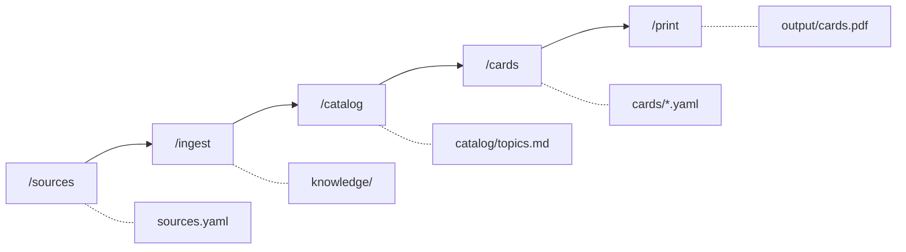

<div align="center">


# Lernkarten

**Turn what you have to learn into flashcards you can hold.**

[](https://github.com/mhabedank/lernkarten/actions/workflows/ci.yml)
[](LICENSE)

</div>

Point it at a folder of lecture PDFs, a textbook, your Zotero library or a web
page. Five commands later you have an A4 PDF: print it double-sided, cut along
the grey lines, and you are holding a stack of paper flashcards.


## Why paper cards

Writing cards by hand is the slow part; reading and shuffling them is the part
that actually makes things stick. This project automates the first and leaves
you the second. Every step writes a plain text file you can read and edit, so
nothing is a black box — if a card is wrong, you fix a line of YAML.

Your material never leaves your machine: sources, extracted texts and cards
are all git-ignored, so a fork of this repo never carries anyone's notes.

## Quick start

You need [Claude Code](https://docs.claude.com/en/docs/claude-code/overview),
Python and a TeX distribution ([details below](#requirements)).

```bash
git clone https://github.com/mhabedank/lernkarten.git
cd lernkarten
claude
```

Then, in the Claude Code session:

```
> /sources ~/Documents/University/Statistics
> /ingest
> /catalog
> /cards Bayes
> /print
```

That is: register where your material lives, read it, let it propose a topic
catalog, write cards for the topics you pick, and build the PDF.

## The five commands

| Command | What it does | What you get |
|---|---|---|
| `/sources` | register your material: folders, PDFs, Zotero, web pages | `sources.yaml` |
| `/ingest` | read the sources and store them as text | `knowledge/<source>/*.md` |
| `/catalog` | derive topics and subtopics from the material | `catalog/topics.md` |
| `/cards` | write cards — everything, or filtered by topic | `cards/<topic>.yaml` |
| `/print` | compile the cards into a print-ready PDF | `output/cards.pdf` |



Every step is repeatable and works incrementally: `/ingest` skips material that
has not changed, `/catalog` extends the topics you already have, `/cards`
appends instead of overwriting. Add a source next month and run the pipeline
again — you only pay for what is new.

A full walkthrough, from an empty clone to the printed PDF, is in
[docs/workflow.md](docs/workflow.md).

## Requirements

| What | Why | Check with |
|---|---|---|
| [Claude Code](https://docs.claude.com/en/docs/claude-code/overview) | runs the skills | `claude --version` |
| Python ≥ 3.10 with PyYAML | build script | `python3 -c "import yaml"` |
| A TeX distribution with `pdflatex` | typesetting the cards | `pdflatex --version` |
| `pdftotext` (poppler) | PDF extraction | `pdftotext -v` |
| Zotero 7 *(optional)* | access to your own library | Zotero is running |
| `tesseract` *(optional)* | OCR for scanned PDFs | `tesseract --version` |

Install the system dependencies:

```bash
# macOS
brew install --cask mactex-no-gui && brew install poppler python
```

```bash
# Debian/Ubuntu
sudo apt-get install texlive-latex-recommended texlive-pictures poppler-utils python3-yaml
```

For cards in a language other than English, swap `texlive-latex-recommended`
for `texlive-lang-all`, which covers every language. MacTeX already does.

PyYAML for Python, if the system package did not cover it:

```bash
python3 -m pip install --user pyyaml
```

Then verify the install — this builds the bundled example cards and writes
nothing:

```bash
python3 scripts/build_pdf.py --check cards/example.yaml
```

Expected output: `OK: 9 cards valid, test compile succeeded (4 pages).`

## What a card looks like

Cards are YAML, one file per topic. `front` and `back` are LaTeX, so formulas
are just `$...$`; `\\` starts a new line, and `%`, `&`, `_`, `#` have to be
escaped.

```yaml
topic: "Probability"
language: english
cards:
  - subtopic: "Bayes' theorem"
    front: "How is Bayes' theorem stated?"
    back: "$P(A \\mid B) = \\dfrac{P(B \\mid A)\\, P(A)}{P(B)}$"
    source: "Lecture 3, slide 12"
```

Cards come out in the language of your sources — German, French, whatever you
feed it. The file says which one (`language: german`, or an ISO code like
`de`), and printing takes care of the rest: hyphenation, quotation marks, the
lot. Card files in different languages can go into the same PDF.

Full example: [cards/example.yaml](cards/example.yaml). You can check card
files at any time with `python3 scripts/build_pdf.py --check cards/*.yaml`.

## Printing and cutting

The PDF puts 8 cards on an A4 page. Fronts and backs are on consecutive pages,
with the backs column-mirrored so they line up after duplex printing.

1. Choose **duplex, flip on long edge**
2. **100 % scale** — not "fit to page"
3. Cut along the grey lines

By default a 5 mm page margin is left free (cards: 100 × 71.75 mm) so printers
with a non-printable edge do not clip anything. Borderless printers get the
full 105 × 74.25 mm (≈ A7) with `--margin 0`; any other value works too, via
`--margin <mm>`. `--no-logo` prints the cards without the logo mark.

## Where your data lives

```
sources.yaml          your sources          (local, never committed)
knowledge/            ingested texts        (local, never committed)
catalog/              the topic catalog     (local, never committed)
cards/                your cards            (local, never committed)
output/               finished PDFs         (local, never committed)
```

Everything else in the repo is tooling: the five skills in `.claude/skills/`,
the build script in `scripts/`, the LaTeX template in `templates/`. `git
status` stays clean no matter how much you ingest.

## Contributing

Bug reports and pull requests are welcome — see
[CONTRIBUTING.md](CONTRIBUTING.md) and our
[Code of Conduct](CODE_OF_CONDUCT.md). Direct pushes to `main` are blocked;
changes go through pull requests that have to pass the CI gates (lint, tests,
card validation, LaTeX build).

## License

[MIT](LICENSE) — for the tools. The material you ingest and turn into cards
stays under its own copyright; it never leaves your machine anyway.
