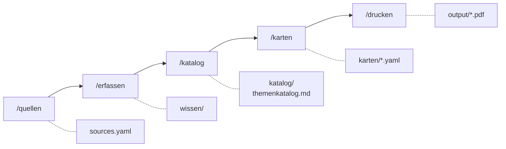

# Lernkarten

[](https://github.com/mhabedank/lernkarten/actions/workflows/ci.yml)
[](LICENSE)

Ein Skill-Set für [Claude Code](https://claude.com/claude-code), das aus
beliebigen Wissensquellen — Ordnern, PDFs, einer Zotero-Bibliothek, Webseiten —
druckfertige Lernkarten macht. Fünf Slash-Befehle führen von der Quelle bis
zum PDF, das man doppelseitig ausdruckt und in Karteikarten schneidet.

Das Repo ist **themen-agnostisch**: es enthält die Werkzeuge, nicht das Wissen.
Ob Statistik, Anatomie, Vokabeln oder Produktmanagement — deine Quellen,
Texte und Karten bleiben lokal und werden nicht versioniert.

## Nutzungsflow



| Befehl | Zweck | Ergebnis |
|---|---|---|
| `/quellen` | Wissensquellen registrieren: Ordner, PDFs, Zotero, Webseiten | `sources.yaml` |
| `/erfassen` | Quellen einlesen und als Text ablegen | `wissen/<quelle>/*.md` |
| `/katalog` | Themen und Unterthemen aus dem Material ableiten | `katalog/themenkatalog.md` |
| `/karten` | Karten schreiben — alles oder nach Thema gefiltert | `karten/<thema>.yaml` |
| `/drucken` | Karten zu einem druckfertigen PDF kompilieren | `output/lernkarten.pdf` |

Jeder Schritt ist wiederholbar und arbeitet inkrementell: `/erfassen`
überspringt unverändertes Material, `/katalog` ergänzt bestehende Themen,
`/karten` hängt an, statt zu überschreiben.

Ein durchgespieltes Beispiel von der leeren Kopie bis zum PDF steht in
[docs/nutzungsflow.md](docs/nutzungsflow.md).

## Voraussetzungen

| Was | Wofür | Prüfen mit |
|---|---|---|
| [Claude Code](https://docs.claude.com/en/docs/claude-code/overview) | führt die Skills aus | `claude --version` |
| Python ≥ 3.9 mit PyYAML | Build-Script | `python3 -c "import yaml"` |
| TeX-Distribution mit `pdflatex` | Kartensatz | `pdflatex --version` |
| `pdftotext` (poppler) | PDF-Extraktion | `pdftotext -v` |
| Zotero 7 *(optional)* | Zugriff auf die eigene Bibliothek | Zotero läuft |
| `tesseract` *(optional)* | OCR für gescannte PDFs | `tesseract --version` |

Das LaTeX-Template braucht `tikz`, `geometry` und `babel` (deutsch) —
in TeX Live und MacTeX ist das alles enthalten.

## Installation

```bash
git clone https://github.com/mhabedank/lernkarten.git
cd lernkarten
```

Systemabhängigkeiten, falls noch nicht vorhanden:

```bash
# macOS
brew install --cask mactex-no-gui && brew install poppler python

# Debian/Ubuntu
sudo apt-get install texlive-latex-recommended texlive-pictures texlive-lang-german poppler-utils python3-yaml
```

PyYAML für Python (falls nicht über das Systempaket installiert):

```bash
python3 -m pip install --user pyyaml
```

Danach die Installation prüfen — der Befehl baut die mitgelieferten
Beispielkarten und schreibt nichts:

```bash
python3 scripts/build_pdf.py --check karten/beispiel.yaml
```

Erwartete Ausgabe: `OK: 9 Karten valide, Probekompilat erfolgreich (4 Seiten).`

## Loslegen

Claude Code im Projektordner starten und dem Flow folgen:

```bash
claude
```

```
> /quellen ~/Documents/Uni/Statistik
> /erfassen
> /katalog
> /karten Bayes
> /drucken
```

Die Skills liegen unter `.claude/skills/` und werden von Claude Code
automatisch gefunden. Die Projektkonventionen — Kartenschema, Stilregeln,
LaTeX-Escaping — stehen in [CLAUDE.md](CLAUDE.md) und gelten für jede
Sitzung in diesem Ordner.

## Verzeichnisse

```
.claude/skills/       Die fünf Slash-Befehle
scripts/build_pdf.py  YAML → LaTeX → PDF
templates/            LaTeX-Template (lernkarten.tex.in)
sources.example.yaml  Vorlage für das Quellenregister
karten/beispiel.yaml  Beispielkarten als Schema-Referenz

sources.yaml          ← deine Quellen        (lokal, nicht versioniert)
wissen/               ← erfasste Texte       (lokal, nicht versioniert)
katalog/              ← Themenkatalog        (lokal, nicht versioniert)
karten/               ← deine Karten         (lokal, nicht versioniert)
output/               ← fertige PDFs         (lokal, nicht versioniert)
```

## Kartenformat

Karten sind YAML, eine Datei pro Thema. `vorne` und `hinten` sind
LaTeX-Quelltext — Mathematik in `$...$`, `\\` erzeugt einen Zeilenumbruch,
Sonderzeichen (`%`, `&`, `_`, `#`) müssen escaped sein:

```yaml
thema: "Wahrscheinlichkeit"
karten:
  - unterthema: "Satz von Bayes"
    vorne: "Wie lautet der Satz von Bayes?"
    hinten: "$P(A \\mid B) = \\dfrac{P(B \\mid A)\\, P(A)}{P(B)}$"
    quelle: "Vorlesung 3, Folie 12"
```

Vollständiges Beispiel: [karten/beispiel.yaml](karten/beispiel.yaml).
Prüfen lassen sich Kartendateien jederzeit mit
`python3 scripts/build_pdf.py --check karten/*.yaml`.

## Drucken und Zuschneiden

Das PDF legt 8 Karten pro A4-Seite an; Vorder- und Rückseiten liegen auf
aufeinanderfolgenden Seiten, die Rückseiten spaltengespiegelt.

1. **Duplexdruck „über lange Kante spiegeln"** wählen
2. **100 % Skalierung** — nicht „an Seite anpassen"
3. entlang der grauen Linien schneiden

Standardmäßig bleiben 5 mm Seitenrand frei (Karten: 100 × 71,75 mm), damit
Drucker mit nicht bedruckbarem Rand nichts abschneiden. Randlos druckende
Geräte bekommen mit `--rand 0` die vollen 105 × 74,25 mm (≈ A7); jeder andere
Wert geht mit `--rand <mm>`.

## Mitmachen

Fehlerberichte und Pull Requests sind willkommen — siehe
[CONTRIBUTING.md](CONTRIBUTING.md). Direkte Pushes auf `main` sind gesperrt;
Änderungen laufen über Pull Requests, die die CI-Quality-Gates
(Lint, Tests, Kartenvalidierung, LaTeX-Build) bestehen müssen.

## Lizenz

[MIT](LICENSE) — die Werkzeuge. Für die Inhalte, die du damit erfasst und in
Karten verwandelst, gilt weiterhin das Urheberrecht der jeweiligen Quelle;
sie bleiben ohnehin lokal.

---

**English summary:** A [Claude Code](https://claude.com/claude-code) skill set
that turns arbitrary knowledge sources (folders, PDFs, a Zotero library, web
pages) into printable flashcards: `/quellen` → `/erfassen` → `/katalog` →
`/karten` → `/drucken` produces a duplex-ready A4 PDF with 8 cards per page.
The tooling is subject-agnostic and in German; your sources, texts and cards
stay local and are never committed.
