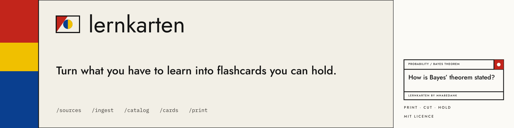
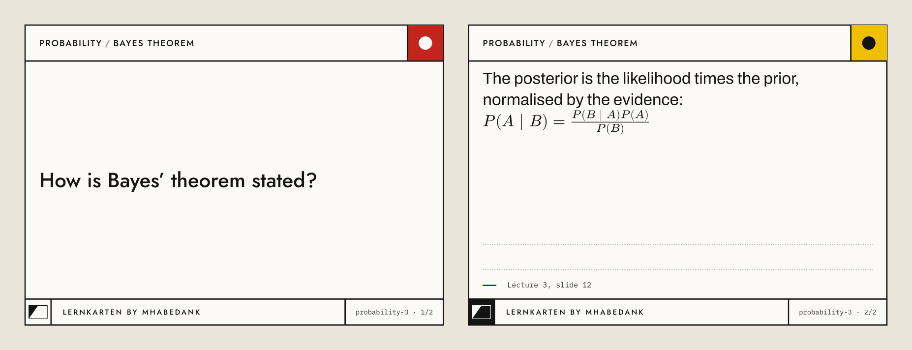

[](https://github.com/mhabedank/lernkarten/actions/workflows/ci.yml)
[](LICENSE)
[](https://docs.claude.com/en/docs/claude-code/overview)

Say what you are trying to learn, then point it at a folder of lecture PDFs, a
textbook, your Zotero library or a web page. A few commands later you have an A4
PDF: print it double-sided, cut along the lines, and you are holding a stack of
paper flashcards — covering the topic you named, not whatever the material
happened to contain.

**[See it →](https://mhabedank.github.io/lernkarten/)**



## Install

In [Claude Code](https://docs.claude.com/en/docs/claude-code/overview):

```
/plugin marketplace add mhabedank/lernkarten
```

```
/plugin install lernkarten@mhabedank
```

That is the whole installation — there is no document toolchain to set up and
nothing to `pip install`. The first time you build a PDF, a 15 MB typesetting
engine is downloaded once and cached; the rest runs on Python 3.12 or newer,
which your machine most likely already has.

## Use it

Go to the folder where you want your cards to live, start Claude Code, and walk
the pipeline:

```
> /learning-goal stats exam in March, Bayes and the estimators
> /sources ~/Documents/University/Statistics
> /ingest
> /catalog
> /cards Bayes
> /print
```

`/learning-goal` is optional — skip it and the pipeline works exactly as it
always did. Set it and `/catalog` builds the topics from what you need to know,
marks what none of your material covers, and `/cards` tells you what the deck is
missing.

That is: say where your material lives, read it, let it propose a topic
catalog, write cards for the topics you pick, and build the PDF.

## The commands


| Command | What it does | What you get |
|---|---|---|
| `/learning-goal` *(optional)* | state what you are trying to learn | `goal.md` |
| `/sources` | register your material: folders, PDFs, Zotero, web pages | `sources.yaml` |
| `/ingest` | read the sources and store them as text | `knowledge/<source>/*.md` |
| `/catalog` | derive topics and subtopics — from your goal if you set one | `catalog/topics.md` |
| `/research-gaps` *(optional)* | research the topics nothing you have covers | `knowledge/<research>/*.md` |
| `/cards` | write cards — everything, or filtered by topic | `cards/<topic>.yaml` |
| `/print` | compile the cards into a print-ready PDF | `output/cards.pdf` |

The two optional steps are what make the deck cover the *topic* rather than the
*material*. Skip them and everything works exactly as it always did.

Every step is repeatable and works incrementally: `/ingest` skips material that
has not changed, `/catalog` extends the topics you already have, `/cards`
appends instead of overwriting. Add a source next month and run the pipeline
again — you only pay for what is new.

A full walkthrough, from nothing to the printed PDF, is in
[docs/workflow.md](docs/workflow.md).

## Why paper cards

Writing cards by hand is the slow part; reading and shuffling them is the part
that actually makes things stick. This project automates the first and leaves
you the second. Every step writes a plain text file you can read and edit, so
nothing is a black box — if a card is wrong, you fix a line of YAML.

Your material never leaves your machine. Sources, extracted texts and cards are
plain files in your own folder, and the pipeline never uploads them anywhere.

## What a card looks like

One card is one idea: a prompt on the front, one fact on the back. The header
band names the topic and the subtopic, the footer carries the card id and
whether you are holding side 1 or side 2 — a dropped stack can always be
rebuilt. The two dotted rules on the back are for the note you write the third
time you get a card wrong.

Cards are YAML, one file per topic. Write the text in single quotes: then a
backslash is a line break, quotation marks work as they are, and formulas go
between dollar signs.

```yaml
topic: 'Probability'
language: english
cards:
  - subtopic: 'Bayes theorem'
    front: 'How is Bayes theorem stated?'
    back: '$P(A | B) = (P(B | A) P(A)) / P(B)$'
    source: 'Lecture 3, slide 12'
```

Cards come out in the language of your sources — German, French, whatever you
feed it. The file says which one (`language: german`, or an ISO code like
`de`), and printing takes care of the rest: hyphenation, quotation marks, the
lot. Card files in different languages can go into the same PDF.

Full example: [cards/example.yaml](cards/example.yaml). You can check card
files at any time:

```bash
lernkarten check cards/*.yaml
```

## Printing and cutting

The PDF puts 8 cards on an A4 page. Fronts and backs are on consecutive pages,
with the backs column-mirrored so they line up after duplex printing.

1. Choose **duplex, flip on long edge** — short edge puts every back upside down
2. **100 % scale** — not "fit to page", which shifts fronts off their backs
3. Cut the long line down the middle first, then the three across

By default a 5 mm page margin is left free (cards: 100 × 71.75 mm) so printers
with a non-printable edge do not clip anything, and crop marks in that margin
show you where to cut. Borderless printers get the full 105 × 74.25 mm (≈ A7)
with `--margin 0`; any other value works too, via `--margin <mm>`. `--no-logo`
prints the cards without the mark and the wordmark.

## Where your files live

```
sources.yaml          your sources
knowledge/            ingested texts
catalog/              the topic catalog
cards/                your cards
output/               finished PDFs
```

All of it is yours, in the folder you started in, in formats you can read.

## Without Claude Code

The build is a plain script and stands on its own:

```bash
git clone https://github.com/mhabedank/lernkarten.git
lernkarten/bin/lernkarten build cards/*.yaml -o output/cards.pdf
```

Options: `--topic` / `--subtopic` to filter, `--margin`, `--language`,
`--no-logo`. `lernkarten engine --check` reports the typesetting engine, and
`LERNKARTEN_ENGINE` points the build at one you installed yourself.

## The design

The card, the mark and the pages that describe them are one system: three
inks, three faces, one grid. It is written down in
[docs/design.md](docs/design.md) — read that before changing how anything
looks. The landing page is [docs/index.html](docs/index.html), served at
[mhabedank.github.io/lernkarten](https://mhabedank.github.io/lernkarten/).

## Contributing

Bug reports and pull requests are welcome — see
[CONTRIBUTING.md](CONTRIBUTING.md) and our
[Code of Conduct](CODE_OF_CONDUCT.md). Direct pushes to `main` are blocked;
changes go through pull requests that have to pass the CI gates (lint, tests,
card validation, PDF build).

Want to try it out or test a change? `python3 scripts/demo.py ~/lernkarten-demo`
sets up a small demo project — invented material, no licence questions — that
you can run the whole pipeline against. [docs/testing.md](docs/testing.md) has
the checklist and describes the automated tests.

## License

[MIT](LICENSE) — for the tools. The material you ingest and turn into cards
stays under its own copyright; it never leaves your machine anyway. The three
shipped typefaces are under the SIL Open Font License; see
[assets/fonts/README.md](assets/fonts/README.md).
