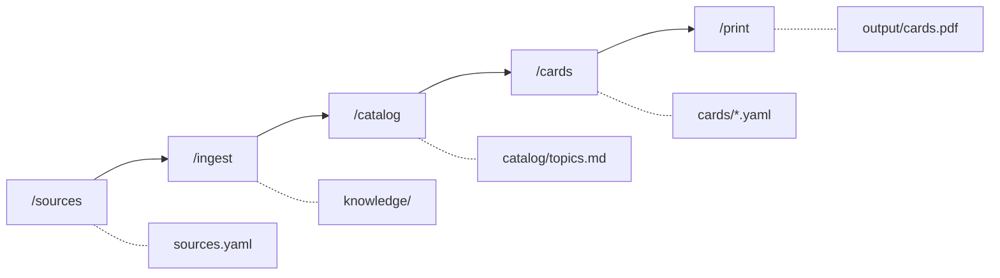

<div align="center">


# Lernkarten

**Turn what you have to learn into flashcards you can hold.**

[](https://github.com/mhabedank/lernkarten/actions/workflows/ci.yml)
[](LICENSE)

</div>

Point it at a folder of lecture PDFs, a textbook, your Zotero library or a web
page. Five commands later you have an A4 PDF: print it double-sided, cut along
the grey lines, and you are holding a stack of paper flashcards.


## Install

In [Claude Code](https://docs.claude.com/en/docs/claude-code/overview):

```
/plugin marketplace add mhabedank/lernkarten
```

```
/plugin install lernkarten@mhabedank
```

That is the whole installation. No document toolchain, no package manager, no
`pip install`. The first time you build a PDF, a 15 MB typesetting engine is
downloaded once and cached; everything else runs on the Python your machine
already has.

## Use it

Go to the folder where you want your cards to live, start Claude Code, and walk
the pipeline:

```
> /sources ~/Documents/University/Statistics
> /ingest
> /catalog
> /cards Bayes
> /print
```

That is: say where your material lives, read it, let it propose a topic
catalog, write cards for the topics you pick, and build the PDF.

## The five commands

| Command | What it does | What you get |
|---|---|---|
| `/sources` | register your material: folders, PDFs, Zotero, web pages | `sources.yaml` |
| `/ingest` | read the sources and store them as text | `knowledge/<source>/*.md` |
| `/catalog` | derive topics and subtopics from the material | `catalog/topics.md` |
| `/cards` | write cards — everything, or filtered by topic | `cards/<topic>.yaml` |
| `/print` | compile the cards into a print-ready PDF | `output/cards.pdf` |



Every step is repeatable and works incrementally: `/ingest` skips material that
has not changed, `/catalog` extends the topics you already have, `/cards`
appends instead of overwriting. Add a source next month and run the pipeline
again — you only pay for what is new.

A full walkthrough, from nothing to the printed PDF, is in
[docs/workflow.md](docs/workflow.md).

## Why paper cards

Writing cards by hand is the slow part; reading and shuffling them is the part
that actually makes things stick. This project automates the first and leaves
you the second. Every step writes a plain text file you can read and edit, so
nothing is a black box — if a card is wrong, you fix a line of YAML.

Your material never leaves your machine. Sources, extracted texts and cards are
plain files in your own folder, and the pipeline never uploads them anywhere.

## What a card looks like

Cards are YAML, one file per topic. Write the text in single quotes: then a
backslash is a line break, quotation marks work as they are, and formulas go
between dollar signs.

```yaml
topic: 'Probability'
language: english
cards:
  - subtopic: 'Bayes theorem'
    front: 'How is Bayes theorem stated?'
    back: '$P(A | B) = (P(B | A) P(A)) / P(B)$'
    source: 'Lecture 3, slide 12'
```

Cards come out in the language of your sources — German, French, whatever you
feed it. The file says which one (`language: german`, or an ISO code like
`de`), and printing takes care of the rest: hyphenation, quotation marks, the
lot. Card files in different languages can go into the same PDF.

Full example: [cards/example.yaml](cards/example.yaml). You can check card
files at any time:

```bash
lernkarten check cards/*.yaml
```

## Printing and cutting

The PDF puts 8 cards on an A4 page. Fronts and backs are on consecutive pages,
with the backs column-mirrored so they line up after duplex printing.

1. Choose **duplex, flip on long edge**
2. **100 % scale** — not "fit to page"
3. Cut along the grey lines

By default a 5 mm page margin is left free (cards: 100 × 71.75 mm) so printers
with a non-printable edge do not clip anything. Borderless printers get the
full 105 × 74.25 mm (≈ A7) with `--margin 0`; any other value works too, via
`--margin <mm>`. `--no-logo` prints the cards without the logo mark.

## Where your files live

```
sources.yaml          your sources
knowledge/            ingested texts
catalog/              the topic catalog
cards/                your cards
output/               finished PDFs
```

All of it is yours, in the folder you started in, in formats you can read.

## Without Claude Code

The build is a plain script and stands on its own:

```bash
git clone https://github.com/mhabedank/lernkarten.git
lernkarten/bin/lernkarten build cards/*.yaml -o output/cards.pdf
```

Options: `--topic` / `--subtopic` to filter, `--margin`, `--language`,
`--no-logo`. `lernkarten engine --check` reports the typesetting engine, and
`LERNKARTEN_ENGINE` points the build at one you installed yourself.

## Contributing

Bug reports and pull requests are welcome — see
[CONTRIBUTING.md](CONTRIBUTING.md) and our
[Code of Conduct](CODE_OF_CONDUCT.md). Direct pushes to `main` are blocked;
changes go through pull requests that have to pass the CI gates (lint, tests,
card validation, PDF build).

## License

[MIT](LICENSE) — for the tools. The material you ingest and turn into cards
stays under its own copyright; it never leaves your machine anyway.
