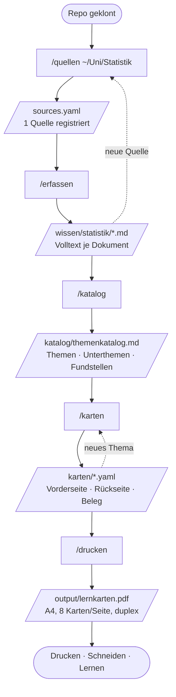

# Nutzungsflow — von der Quelle zur Karteikarte

Diese Seite spielt den kompletten Weg einmal durch: frisch geklontes Repo,
ein Ordner mit Vorlesungs-PDFs, am Ende ein PDF im Drucker. Das Thema ist
beliebig — hier Statistik, genauso gut Anatomie, Vokabeln oder Kochrezepte.

## Überblick



Jeder Schritt schreibt eine Datei, die du lesen und von Hand korrigieren
kannst. Nichts ist eine Blackbox: läuft ein Schritt schief, korrigierst du
seine Ausgabedatei und machst mit dem nächsten weiter.

---

## Schritt 0 — Sitzung starten

```bash
cd lernkarten
claude
```

Claude Code liest `CLAUDE.md` (die Projektkonventionen) und findet die fünf
Skills unter `.claude/skills/`. Ab hier passiert alles im Chat.

## Schritt 1 — `/quellen`: Wissensquellen registrieren

```
> /quellen ~/Documents/Uni/Statistik
```

Der Typ wird aus dem Argument erschlossen — ein existierender Ordner wird
`typ: ordner`, eine `.pdf`-Datei `typ: pdf`, eine URL `typ: webseite`, das
Stichwort „Zotero" `typ: zotero`. Ergebnis in `sources.yaml`:

```yaml
quellen:
  - id: uni-statistik
    typ: ordner
    pfad: ~/Documents/Uni/Statistik
    muster: "*.pdf"
```

Weitere Aufrufe hängen an. `/quellen` ohne Argument zeigt die Liste und
markiert Quellen, die nicht mehr erreichbar sind; „entferne uni-statistik"
löscht den Eintrag (die bereits erfassten Texte bleiben liegen).

**Typische Aufrufe**

| Eingabe | Was daraus wird |
|---|---|
| `/quellen ~/Uni/Statistik` | Ordner, rekursiv nach PDFs |
| `/quellen ~/Books/Bishop.pdf` | einzelne PDF-Datei |
| `/quellen https://de.wikipedia.org/wiki/Satz_von_Bayes` | Webseite |
| `/quellen füge meine Zotero-Sammlung "ML" hinzu` | Zotero-Sammlung |

## Schritt 2 — `/erfassen`: Inhalte einlesen

```
> /erfassen
```

Holt jede registrierte Quelle und legt pro Dokument eine Markdown-Datei mit
Frontmatter unter `wissen/<quellen-id>/` ab:

```markdown
---
quelle: uni-statistik
dokument: "Vorlesung 03 — Bedingte Wahrscheinlichkeit"
pfad: "/Users/…/Uni/Statistik/vl03.pdf"
erfasst: 2026-08-12
---

Bedingte Wahrscheinlichkeit …
```

Der Text wird nicht zusammengefasst — hier zählt Vollständigkeit; das
Verdichten passiert erst im nächsten Schritt. Gescannte PDFs ohne Textebene
gehen automatisch durch OCR (`tesseract`), Infografiken und Diagramme werden
bildlich gelesen statt per OCR zerhackt.

**Inkrementell:** Ein zweiter Aufruf überspringt alles, was sich seit dem
letzten Mal nicht geändert hat. Webseiten werden nach 7 Tagen erneut geholt.
`/erfassen uni-statistik` beschränkt den Lauf auf eine Quelle.

**Grenzen:** Paywall-Inhalte werden nicht umgangen. Für Seiten, die eine
angemeldete Sitzung brauchen, gibt es `login: true` in `sources.yaml` — dann
läuft der Abruf über den bereits angemeldeten Browser, ohne dass irgendwo
Zugangsdaten eingetippt werden.

## Schritt 3 — `/katalog`: Themen ableiten

```
> /katalog
```

Verdichtet `wissen/` zu `katalog/themenkatalog.md`. Themen werden nach Inhalt
geschnitten, nicht nach Quelle — dieselbe Sache aus zwei Quellen ist ein
Thema mit zwei Fundstellen:

```markdown
## Wahrscheinlichkeitsrechnung
Grundlagen der Wahrscheinlichkeit und ihrer Rechenregeln.

### Satz von Bayes
Umkehrung bedingter Wahrscheinlichkeiten; Prior, Likelihood, Posterior.
Fundstellen: [vl03](../wissen/uni-statistik/vl03.md), …
```

Diese Datei ist das Auswahlmenü für den nächsten Schritt. Sie darf und soll
von Hand editiert werden: Themen umbenennen, zusammenlegen, Unerwünschtes
streichen — `/karten` folgt dem, was hier steht.

## Schritt 4 — `/karten`: Karten schreiben

```
> /karten                    # alles, was im Katalog steht
> /karten Bayes              # nur das passende Unterthema
> /karten Wahrscheinlichkeit # nur ein Thema
```

Pro Unterthema entstehen 3–8 Karten in `karten/<thema-slug>.yaml`. Die Regeln
dafür stehen in [CLAUDE.md](../CLAUDE.md): eine Karte = ein Fakt, aktive
Frageformulierung, Vorderseite maximal zwei Zeilen, Rückseite maximal sechs —
die Karte ist nur 100 × 72 mm groß.

```yaml
thema: "Wahrscheinlichkeitsrechnung"
karten:
  - unterthema: "Satz von Bayes"
    vorne: "Wie lautet der Satz von Bayes?"
    hinten: "$P(A \\mid B) = \\dfrac{P(B \\mid A)\\, P(A)}{P(B)}$"
    quelle: "VL 03, Folie 12"
```

Zum Schluss validiert der Skill selbst mit
`python3 scripts/build_pdf.py --check karten/*.yaml`.

**Merge statt Überschreiben:** Ein zweiter Lauf zum selben Thema hängt neue
Karten an und dupliziert keine bestehenden Vorderseiten. Nur auf
ausdrückliches „neu generieren" wird ersetzt.

## Schritt 5 — `/drucken`: PDF bauen

```
> /drucken
> /drucken nur Bayes
```

Ruft das Build-Script auf und schickt dir das PDF:

```bash
python3 scripts/build_pdf.py karten/*.yaml -o output/lernkarten.pdf
```

Dann drucken: **Duplex „über lange Kante spiegeln", 100 % Skalierung**, und
entlang der grauen Linien schneiden. Vorder- und Rückseite liegen dadurch
exakt übereinander.

---

## Das Build-Script direkt aufrufen

Der letzte Schritt braucht kein Claude — das Script steht für sich:

```bash
# Alles bauen
python3 scripts/build_pdf.py karten/*.yaml -o output/lernkarten.pdf

# Nur ein Thema, nur ein Unterthema
python3 scripts/build_pdf.py karten/*.yaml --thema "Statistik" --unterthema "Bayes"

# Nur validieren, kein PDF schreiben (das nutzt auch die CI)
python3 scripts/build_pdf.py --check karten/*.yaml

# Randlos drucken: volle A7-Karten statt 100 × 71,75 mm
python3 scripts/build_pdf.py karten/*.yaml --rand 0
```

## Wenn etwas klemmt

| Symptom | Ursache | Abhilfe |
|---|---|---|
| `LaTeX-Fehler … Betroffene Karte: bayes-4` | unescapetes `%`, `&`, `_`, `#` oder ein ASCII-`"` im YAML-String | Zeichen in der genannten Karte escapen, Anführungszeichen als `\glqq …\grqq{}` |
| `WARNUNG: Overfull …` | Karte passt nicht auf die Fläche | Text kürzen oder auf zwei Karten aufteilen — nicht die Schrift verkleinern |
| `Keine Karten nach Filterung übrig` | `--thema`/`--unterthema` trifft nichts | Schreibweise gegen die YAML-Datei prüfen; der Filter matcht Teilstrings |
| Vorder- und Rückseite versetzt | Duplex-Einstellung falsch | „über lange Kante spiegeln", 100 % Skalierung, nicht „an Seite anpassen" |
| Zotero-Erfassung bricht ab | lokale API antwortet nicht | Zotero 7 starten, unter Einstellungen → Erweitert die lokale API aktivieren |
| `pdflatex: command not found` | keine TeX-Distribution | siehe Installation im [README](../README.md#installation) |

## Wo deine Daten liegen

`sources.yaml`, `wissen/`, `katalog/`, `karten/` und `output/` sind in
`.gitignore` ausgenommen. Ein `git status` bleibt sauber, egal wie viel du
erfasst — und ein Fork des Repos enthält nie fremdes Material. Willst du
deine Karten trotzdem versionieren, ist ein eigenes privates Repo im Ordner
`karten/` der einfachste Weg.
