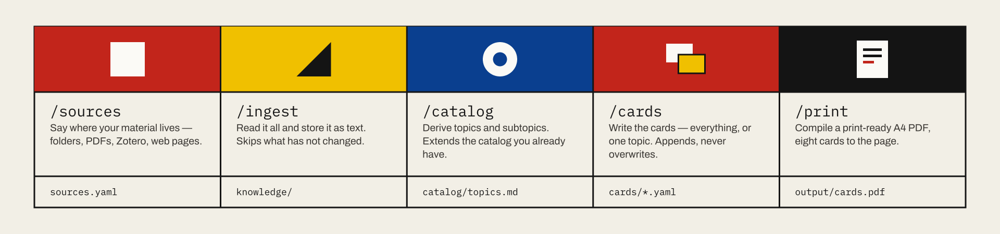

# Workflow — from a source to a printed card

This page walks the whole path once: an empty folder, a stack of lecture PDFs,
and a PDF in the printer at the end. The subject is arbitrary — here it
is statistics, but anatomy, vocabulary or recipes work just as well.

## Overview



Every step writes a file you can read and correct by hand. Nothing is a black
box: if a step goes wrong, you fix its output file and carry on with the next
one. And every step can be run again: a new source goes back to `/sources`, a
new topic back to `/cards`.

---

## Step 0 — start a session

```bash
mkdir ~/flashcards && cd ~/flashcards
claude
```

Any folder will do — this is where your sources, texts and cards will live.
The five commands come from the plugin (see [Install](../README.md#install)).
Everything from here happens in the chat.

## Step 1 — `/sources`: register your material

```
> /sources ~/Documents/University/Statistics
```

The type is inferred from the argument — an existing folder becomes
`type: folder`, a `.pdf` file `type: pdf`, a URL `type: web`, and the word
"Zotero" `type: zotero`. The result lands in `sources.yaml`:

```yaml
sources:
  - id: university-statistics
    type: folder
    path: ~/Documents/University/Statistics
    pattern: "*.pdf"
```

Further calls append. `/sources` without an argument lists everything and flags
sources that are no longer reachable; "remove university-statistics" deletes
the entry (already ingested texts stay where they are).

**Typical calls**

| Input | What it becomes |
|---|---|
| `/sources ~/University/Statistics` | folder, recursively for PDFs |
| `/sources ~/Books/Bishop.pdf` | a single PDF file |
| `/sources https://en.wikipedia.org/wiki/Bayes%27_theorem` | web page |
| `/sources add my Zotero collection "ML"` | Zotero collection |

## Step 2 — `/ingest`: read the content

```
> /ingest
```

Fetches every registered source and stores one markdown file with frontmatter
per document under `knowledge/<source-id>/`:

```markdown
---
source: university-statistics
document: "Lecture 03 — Conditional probability"
path: "/Users/…/University/Statistics/lecture03.pdf"
ingested: 2026-08-12
---

Conditional probability …
```

The text is not summarised — completeness is what counts here; condensing
happens in the next step. Scanned PDFs without a text layer are read as images,
and so are infographics and diagrams — no OCR to garble them.

**Incremental:** a second call skips everything that has not changed since last
time. Web pages are re-fetched after 7 days. `/ingest university-statistics`
limits the run to one source.

**Limits:** paywalls are not circumvented. For pages that need a signed-in
session there is `login: true` in `sources.yaml` — the fetch then goes through
your already signed-in browser, and no credentials are typed anywhere.

## Step 3 — `/catalog`: derive the topics

```
> /catalog
```

Condenses `knowledge/` into `catalog/topics.md`. Topics are cut by content, not
by source — the same thing from two sources is one topic with two references:

```markdown
## Probability
The basics of probability and the rules for calculating with it.

### Bayes' theorem
Inverting conditional probabilities; prior, likelihood, posterior.
References: [lecture03](../knowledge/university-statistics/lecture03.md), …
```

This file is the selection menu for the next step. It may and should be edited
by hand: rename topics, merge them, delete what you do not want — `/cards`
follows whatever is written here.

## Step 4 — `/cards`: write the cards

```
> /cards                 # everything in the catalog
> /cards Bayes           # just the matching subtopic
> /cards Probability     # just one topic
```

Each subtopic yields 3–8 cards in `cards/<topic-slug>.yaml`. The rules are in
[CLAUDE.md](../CLAUDE.md): one card = one fact, active question phrasing, front
at most two lines, back at most six — the card is only 100 × 72 mm.

```yaml
topic: 'Probability'
language: english
cards:
  - subtopic: 'Bayes theorem'
    front: 'How is Bayes theorem stated?'
    back: '$P(A | B) = (P(B | A) P(A)) / P(B)$'
    source: 'Lecture 03, slide 12'
```

Card text is Typst markup: `$...$` for maths, a backslash for a line break,
`#list([a], [b])` for bullets. Single quotes in YAML keep it readable.

`language` is the language of your sources, written the way you would say it
(`german`, `de`, `french`, …). It is the only thing printing needs to hyphenate
correctly, and card files in different languages can share one PDF.

Finally the skill validates its own output with `lernkarten check cards/*.yaml`.

**Merge instead of overwrite:** a second run on the same topic appends new
cards and does not duplicate existing fronts. Only an explicit "regenerate"
replaces them.

## Step 5 — `/print`: build the PDF

```
> /print
> /print only Bayes
```

Calls the build script and sends you the PDF:

```bash
lernkarten build cards/*.yaml -o output/cards.pdf
```

Then print: **duplex, "flip on long edge", 100 % scale**. Cut the long line
down the middle first, then the three across — the card frames and the crop
marks in the margin show you where. Front and back end up exactly on top of
each other.

What comes out is described band by band in [design.md](design.md): topic and
subtopic in the header, one prompt in the field, the card id and `1/2` or `2/2`
in the footer, and two dotted rules on the back for your own notes.

---

## Calling the build script directly

The last step does not need Claude — the script stands on its own:

```bash
# Build everything
lernkarten build cards/*.yaml -o output/cards.pdf

# One topic only, one subtopic only
lernkarten build cards/*.yaml --topic 'Statistics' --subtopic 'Bayes'

# Validate only, write no PDF (this is what CI uses)
lernkarten check cards/*.yaml

# Borderless printing: full A7 cards instead of 100 × 71.75 mm
lernkarten build cards/*.yaml --margin 0

# Override the language of files that do not declare one
lernkarten build cards/*.yaml --language german

# Without the mark and the wordmark in the footer
lernkarten build cards/*.yaml --no-logo

# Where is the typesetting engine?
lernkarten engine --check
```

## When something goes wrong

| Symptom | Cause | Fix |
|---|---|---|
| `The typesetter rejected the cards … Offending card: bayes-4` | the markup in that card is not valid Typst | fix the named card — usually an unescaped `#`, `_` or `*`, or LaTeX-style maths that needs Typst syntax |
| `WARNING: card … does not fit` | the text is too long for the card | shorten it or split it across two cards — do not shrink the font |
| `No cards left after filtering` | `--topic`/`--subtopic` matches nothing | check the spelling against the YAML file; the filter matches substrings |
| Front and back are offset | wrong duplex setting | "flip on long edge", 100 % scale, not "fit to page" |
| Hyphenation looks wrong | the card file has no `language:` key | add it (`language: german`), or build once with `--language german` |
| Zotero ingest aborts | the local API does not answer | start Zotero 7 and enable the local API under Settings → Advanced |
| `could not download the typesetting engine` | no network on the first build | retry when online, or install typst yourself and set `LERNKARTEN_ENGINE` |

## Where your data lives

`sources.yaml`, `knowledge/`, `catalog/`, `cards/` and `output/` are excluded
in `.gitignore`. A `git status` stays clean no matter how much you ingest — and
a fork of the repo never contains anyone else's material. If you do want to
version your cards, a separate private repo inside the `cards/` folder is the
simplest way.
